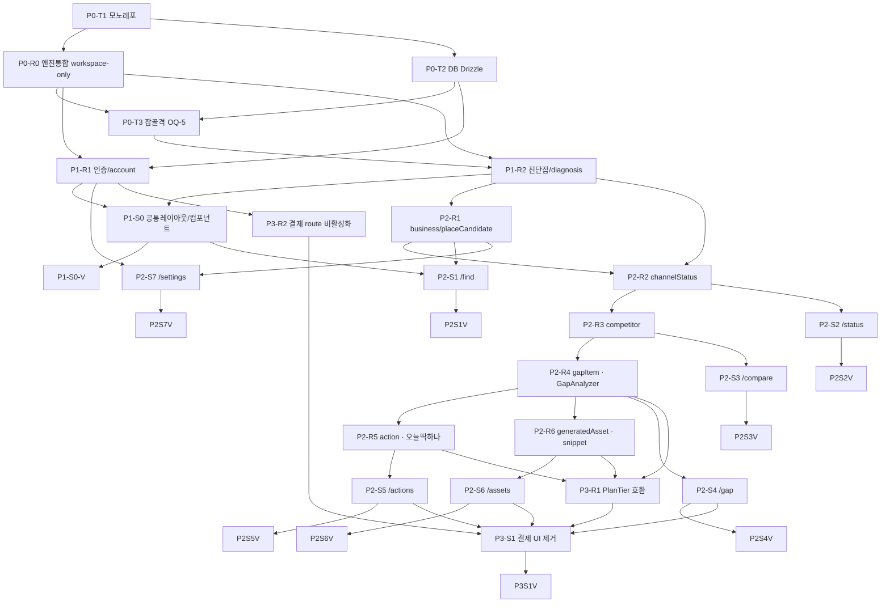

# 06-Tasks — 태스크 분해 (Domain-Guarded v2.0)

> 제품: (가칭 미정 · OQ-1) 소상공인 셀프서비스 검색·AI 가시성 진단 + 경쟁 비교 + 역공학 + 행동 도구 (네이버+구글, 한눈에)
> 엔진: `x-sag`(github.com/choiwjun/x-sag) 분석 엔진 **재사용**. 새 git 레포의 새 풀스택 제품(Next.js App Router).
> 상류 문서: `01-prd.md`(REQ-001~007), `02-trd.md`(아키텍처), `04-database-design.md`(스키마), `05-design-system.md`(UX), `07-coding-convention.md`(헌법·카피 가드), `specs/domain/resources.yaml`(10 리소스), `specs/screens/*.yaml`(S1~S7), `specs/shared/*.yaml`(공통 컴포넌트·타입), `DECISION_LOG.md`(OQ 결정).

> 상태 주석: 이 문서의 체크박스는 **계획 카탈로그/이력**이다. 현재 구현 진실은 `docs/planning/HANDOFF-2026-07-06-product-gap-analysis.md`와 Ultragoal ledger이며, 이 문서에서 무관한 과거 태스크를 일괄 완료 처리하지 않는다.

---

## 1. 목적

REQ-001~007과 화면 S1~S7을 **엔진 재사용 원칙** 위에서 실행 가능한 태스크로 분해한다. 각 태스크는 담당 specialist·REQ ID·헌법 참조·TDD(RED→GREEN→REFACTOR)·의존(Depends On)·병렬 가능 여부를 명시한다.

## 2. 범위 (v1 — OQ-2 확정)

| 포함 (v1 ✅) | 보류 (v1.5 ⏭) | 영구 제외 (🚫) |
|---|---|---|
| 가게 찾기(네이버 플레이스) → 내 상태(네이버 실측 + on-page SEO/AEO/GEO + AI 인용 샘플) → 경쟁 비교 → **역공학 갭(핵심 차별)** → 행동 4분류 + "오늘 딱 하나" → 쉬운 생성물. Radar `radar_subscriptions`는 유료 결제가 아니라 SME 홈 카드/주간 scanner가 쓰는 무료 `trialing/active` 스캔 예약 리소스 | 구글 실 SERP 순위(SerpAPI 키 OQ-4), 재진단/추이 모니터링, grounded AI 대량측정 | 유료 결제/구독 과금, Toss billing, Kakao/SMS 알림, 대행/매칭 마켓플레이스, 외부 업체 중개·정산, 매출/스마트플레이스 성과연결 |

## 3. 엔진 재사용 원칙 (CRITICAL — 모든 R 태스크의 전제)

- **백엔드 Resource 태스크 `P{N}-R{M}` = 맨바닥 빌드 아님.** x-sag `core-engine` + `contracts(diagnosis)` 계약·로직을 **통합·배선·번역(adapting)** 하는 작업이다. (diagnosis/gap/competitor/snippet 계약 차용 + 네이버 노출 실측·AI 인용 게이팅)
- **프론트 Screen 태스크 `P{N}-S{M}` = 신규 빌드.** Next.js App Router 7화면. 비IT 사장님 UX(신호등·전문용어 0·모바일·한 번에 하나·응원 톤·결제 CTA 미노출)로 새로 짓는다.
- **경계 고정(07 §2):** 앱↔엔진 입출력은 `packages/contracts` 타입으로만. 앱이 엔진 내부 구현에 직접 의존 금지.
- **점수 비노출(05·07 §4):** 엔진 반환 점수는 내부 저장만. UI 전달 레이어에서 신호등 enum(`green`/`yellow`/`red`)으로 변환하는 **단일 함수**만 통과.
- **OQ-6 해소(현재 SME v1):** 현재는 `packages/*`를 모노레포 **workspace-only TS 소스 패키지**로 import한다. GitHub Packages 발행은 dist build·package exports·버전 태그·release workflow를 의도적으로 추가한 뒤 별도 결정으로 유예한다.

## 4. ICV 결과 (Interface Contract Validation)

화면 `data_requirements`(specs/screens) ↔ 도메인 리소스(resources.yaml) ↔ 엔진 계약(x-sag contracts) 3중 대조.

| 화면 | 요구 리소스 | 매핑 태스크 | 누락 |
|---|---|---|---|
| S1 | placeCandidate, business, diagnosis | P2-R1, P1-R2 | 0 |
| S2 | diagnosis, channelStatus | P1-R2, P2-R2 | 0 |
| S3 | competitor, channelStatus | P2-R3, P2-R2 | 0 |
| S4 | gapItem | P2-R4 | 0 |
| S5 | action | P2-R5 | 0 |
| S6 | generatedAsset | P2-R6 | 0 |
| S7 | account, businessSettings | P1-R1, P2-R1 | 0 |
| 공통 | Signal/DiagnosisStatus/Channel/CompetitorSource/GapActionTier/ActionTier/AssetType/Priority/PlanTier | P1-S0(types→UI 변환), 각 R | 0 |

**결과: 누락 0건 — ICV 통과.** 모든 화면 데이터 요구가 리소스로 충족되고, 모든 리소스가 x-sag 계약으로 추적된다(resources.yaml `source` 필드). PlanTier/isPaid는 서버 응답 호환 필드로만 남기며, 현재 SME v1은 결제 CTA나 유료 잠금 해제를 구현하지 않는다.

## 5. 병렬 규칙 (요약)

1. **R 태스크끼리:** 상호 의존 없으면 병렬. (예: P2-R2/R3/R4/R5/R6은 P1-R2 잡 인프라 완료 후 서로 병렬 가능, 단 R4←R3, R5←R4, R6←R4의 데이터 의존 존재)
2. **S 태스크:** 관련 R 태스크 완료 후 시작 (화면은 리소스 산출 후 배선).
3. **V(연결점 검증):** 관련 R·S 태스크 모두 완료 후.
4. **오케스트레이터 코드 작성 금지(CLAUDE.md §4):** 조율자는 분해·디스패치·병합·판정만. 구현은 specialist가 Worktree에서.
5. **TDD 강제:** 모든 태스크 RED(실패 테스트) → GREEN(통과) → REFACTOR.

---

# Phase 0 — 셋업

> 목표: 모노레포 골격 + 엔진 통합 자리 + DB + 백그라운드 잡 골격. **OQ-6은 workspace-only 패키지 사용으로 해소, OQ-5는 diagnoses DB-backed queue + 경량 rate limit로 해소.**

| ID | 태스크 | 담당 | REQ | 헌법 | 병렬 | Depends On |
|---|---|---|---|---|---|---|
| P0-T1 | 모노레포 셋업 | backend | — | — | 시작점 | — |
| P0-R0 | x-sag 엔진 통합 셋업 [OQ-6: workspace-only] | backend | 전체 | 07 §2 | P0-T1 후 | P0-T1 |
| P0-T2 | DB(Postgres+Drizzle) 스키마 차용 | database | 전체 | common/uuid, common/seed-validation | P0-R0 병렬 | P0-T1 |
| P0-T3 | 백그라운드 잡 골격 [OQ-5: DB-backed queue] | backend | REQ-002 | nextjs/api-routes | P0-T2 후 | P0-T2, P0-R0 |

- [ ] **P0-T1 모노레포 + 앱/엔진 골격** — backend specialist
  - 내용: 새 git 레포(x-sag와 분리). 워크스페이스 모노레포 — `apps/web`(Next.js App Router, TS strict) + `packages/engine`(x-sag 엔진 자리, 비어 있음) + `packages/contracts`(엔진 경계 타입 자리). env(.env 스캐폴드), lint(ESLint)·test(Vitest) 골격, Tailwind v4 설정.
  - 헌법: `tailwind/v4-syntax.md`(Tailwind 설정), `nextjs/api-design.md`(라우트 구조 골격).
  - TDD: RED `pnpm test`가 골격 스모크 테스트에서 실패 → GREEN 앱 부팅+빈 패키지 import 통과 → REFACTOR 워크스페이스 경로/tsconfig 정리.
  - 병렬: 시작점(선행 없음).

- [ ] **P0-R0 x-sag 엔진 통합 셋업 [OQ-6: 현재 workspace-only]** — backend specialist
  - 내용: x-sag `core-engine`(크롤·파서·analyzers·scoring·v2: gap/competitor/serp/geo-validator/nlp) + `contracts`(diagnosis/api 타입)를 `packages/engine`·`packages/contracts`로 가져와 현재 모노레포 workspace 패키지로 import한다. `packages/*`는 TS 소스·private 패키지로 내부 소비하며, GitHub Packages 외부 발행은 dist 산출물·package exports·버전 태그·release workflow가 준비될 때까지 유예한다. `naver-presence`·`llm-provider`·`snippet` 로직도 통합 범위.
  - 헌법: `07 §2 엔진 통합 규칙`(경계 고정 — contracts 타입으로만 입출력).
  - TDD: RED 앱에서 `import { DiagnosisJson } from '@contracts'` 타입 참조 실패 → GREEN contracts 타입 import + core-engine 함수 시그니처 노출 통과 → REFACTOR 엔진 내부 구현 비노출(배럴 export 경계).
  - 발명 금지: 현재 패키지를 publishable artifact로 포장하거나 GitHub Actions/release workflow를 추가하지 않는다. 앱↔엔진 경계는 배럴 export와 `packages/contracts`로 제한한다.
  - 병렬: P0-T1 후. P0-T2와 병렬 가능.

- [ ] **P0-T2 DB(Postgres + Drizzle) — x-sag diagnosis 스키마 차용** — database specialist
  - 내용: Postgres + Drizzle. x-sag `contracts` diagnosis 스키마를 차용해 `diagnosis`/`engine_result`/`business`/`competitor`/`gap_row`/`action`/`generated_asset`/`account` 테이블 마이그레이션. 모든 식별자 UUID v4. seed 검증 규약 적용. **점수 컬럼은 내부 저장만**(UI 비노출 — 07 §4).
  - 헌법: `common/uuid.md`(UUID v4 전 식별자), `common/seed-validation.md`(시드·검증), `04-database-design.md` 개념 모델 1:1 명명.
  - TDD: RED 마이그레이션 미적용 상태 쿼리 실패 → GREEN 마이그레이션 적용 + seed 검증 통과 → REFACTOR 인덱스/제약 정리.
  - 병렬: P0-T1 후. P0-R0와 병렬.

- [x] **P0-T3 백그라운드 잡 골격 [OQ-5 해소: diagnoses DB-backed queue + 경량 rate limit]** — backend specialist
  - 내용: 느린 분석(크롤·SERP·AI 인용)을 동기 처리하지 않도록 잡 큐 골격. enqueue → worker → status(`queued|running|completed|failed`) → diagnosis 반영. 현재 SME v1은 `diagnoses` 행을 queue 상태·attempt/error/payload 저장소로 쓰는 DB-backed queue와 경량 in-memory API rate limit로 시작한다. BullMQ/Redis 등 분산 인프라는 같은 인터페이스 뒤에서 future ops로 교체한다. 비용 게이팅은 `defaultCostGate` 정책과 `diagnoses.job_payload.costGate.llmValidation` 운영 evidence로 연결된다.
  - 헌법: `nextjs/api-routes.md`(enqueue Route Handler 리소스 중심), `02-trd §3`(상태 모델).
  - TDD: queued→running→completed/failed 전이, job payload recovery, cost gate 정책/증거 테스트로 회귀 방지.
  - 병렬: P0-T2 + P0-R0 후.

**Phase 0 게이트:** 앱 부팅 + 엔진 타입 import + DB 마이그레이션 + DB-backed 잡 완주 = Green. OQ-5는 현재 SME v1 구현으로 닫혔고, 분산 queue/rate limit은 future ops다. OQ-6은 현재 workspace-only로 닫혔으며 외부 발행은 현재 게이트가 아니다.

---

# Phase 1 — 공통 (인증 · 진단 잡 인프라 · 공통 레이아웃)

> 목표: 모든 화면이 의존하는 공통 토대 — 계정/인증, 진단 잡 리소스, 공통 레이아웃/컴포넌트.

| ID | 태스크 | 담당 | REQ | 헌법 | 병렬 | Depends On |
|---|---|---|---|---|---|---|
| P1-R1 | 인증/계정 (account) | backend | REQ-001 | nextjs/auth, common/uuid | R2와 병렬 | P0-T2, P0-R0 |
| P1-R2 | 진단 잡 인프라 (diagnosis) | backend | REQ-002 | nextjs/api-routes | R1과 병렬 | P0-T3, P0-R0 |
| P1-S0 | 공통 레이아웃/공통 컴포넌트 | frontend | 전체 | tailwind/v4-syntax, nextjs/auth | R1·R2 후 | P1-R1, P1-R2 |
| P1-S0-V | 공통 연결점 검증 | test | 전체 | — | P1-S0 후 | P1-R1, P1-R2, P1-S0 |

- [ ] **P1-R1 인증/계정 리소스(account)** — backend specialist
  - 내용: 단일 인증 체계(B2C 셀프서비스 직판). `account`(id, email) 리소스 + 로그인/세션. x-sag 계정/인증 계약 재사용. S7(auth: true)·가게 정보 관리의 토대.
  - 리소스: `account` (used_by S7). UUID v4 식별자.
  - 헌법: `nextjs/auth.md`(단일 인증), `common/uuid.md`.
  - TDD: RED 미인증 보호 라우트 접근 차단 안 됨 → GREEN 로그인 후 세션·account 조회 통과 → REFACTOR 세션 헬퍼 추출.
  - 병렬: P0-T2/P0-R0 후. P1-R2와 병렬.

- [ ] **P1-R2 진단 잡 인프라(diagnosis 리소스 — x-sag runDiagnosisPipeline 통합)** — backend specialist
  - 내용: `diagnosis` 리소스(id, businessId, status, overallSignal, startedAt, completedAt). **x-sag `runDiagnosisPipeline()` 통합** — enqueue→실행→DiagnosisJson 산출→DB 반영. status 전이(queued→running→done/failed)를 화면 진행 표시용으로 노출. P0-T3 잡 골격 위에 실제 파이프라인 배선. 비용 게이팅(grounded llmValidation·SERP) 적용 자리.
  - 리소스: `diagnosis` (used_by S1, S2). 엔진 계약 `runDiagnosisPipeline` / `DiagnosisJson`.
  - 헌법: `nextjs/api-routes.md`(리소스 중심 진단 enqueue/status), `07 §2`(엔진 경계).
  - TDD: RED 진단 enqueue 후 DiagnosisJson 미반영 → GREEN 파이프라인 완주 + overallSignal·status DB 반영 통과 → REFACTOR 게이팅 함수/캐싱 경계 정리.
  - 병렬: P0-T3/P0-R0 후. P1-R1과 병렬.

- [ ] **P1-S0 공통 레이아웃 + 공통 컴포넌트 (specs/shared 참조)** — frontend specialist
  - 내용: App Router 루트 레이아웃(모바일 우선, 큰 글씨/버튼) + 공통 컴포넌트 6종 신규 빌드 — `app_header`(가게명+설정 진입, **브랜드 영역 [OPEN OQ-1] placeholder**), `signal_light`(Signal→🟢🟡🔴+한 줄, **점수 절대 비노출**), `step_nav`(이전/다음, S2~S6 자유 왕복), `big_copy_button`(클립보드+"복사됐어요" 토스트), `today_one_banner`(오늘 딱 하나). 결제 제외 범위에 따라 유료 경계 오버레이는 만들지 않는다. + **types.yaml enum→UI 변환 단일 함수**(Signal/Channel/ActionTier/AssetType→사장님 언어, enum 코드 비노출).
  - UX 수용기준(05): 전문용어 노출 0 / 신호등(점수 숨김) / 모바일·큰 버튼 / 한 번에 하나 / 응원 톤 / 정직성 카피 가드(인과 단정 0). **AC-7 "사장님 이해도 테스트" 게이트 대상**(01 AC-7).
  - 헌법: `tailwind/v4-syntax.md`(모바일·큰 버튼), `nextjs/auth.md`(헤더 인증 상태).
  - TDD: RED signal_light에 점수(number) props 전달 시 차단 안 됨 / 전문용어 문자열 렌더 → GREEN Signal enum만 받아 신호등 렌더 + 전문용어 0 + 변환 함수 통과 → REFACTOR 컴포넌트 토큰화.
  - 병렬: P1-R1·P1-R2 후.

- [ ] **P1-S0-V 공통 연결점 검증** — test specialist
  - 내용: 인증 보호 라우트(S7) 접근 제어 / 진단 status가 공통 진행 UI에 반영 / 공통 컴포넌트가 enum 계약대로 동작 / 점수·전문용어·인과 카피 렌더 0건(정직성 가드 회귀 테스트).
  - TDD: RED 가드 미적용 → GREEN 가드 통과.
  - 병렬: P1-R1·P1-R2·P1-S0 후.

---

# Phase 2 — 핵심 루프

## 2-A. Resource 태스크 (엔진 통합·배선·번역)

> 모든 R 태스크는 **x-sag 엔진 통합**이다(맨바닥 아님). diagnosisId 기준으로 DiagnosisJson을 읽어 리소스로 번역한다.

| ID | 태스크 | 담당 | REQ | 화면 | 엔진 계약 | 병렬 | Depends On |
|---|---|---|---|---|---|---|---|
| P2-R1 | business/placeCandidate | backend | REQ-001 | S1, S7 | naver place search | R2~와 병렬 | P1-R2 |
| P2-R2 | channelStatus | backend | REQ-002 | S2 | naverPresence+analyzers+llmValidation | R1 후 | P1-R2, P2-R1 |
| P2-R3 | competitor | backend | REQ-003 | S3 | competitorTop+llmValidation.competitors | R2 후 | P2-R2 |
| P2-R4 | gapItem | backend | REQ-004 | S4 | **v2/gap GapAnalyzer 통합·배선** | R3 후 | P2-R3 |
| P2-R5 | action | backend | REQ-005 | S5 | GapAnalyzer actionType→4분류 | R4 후 | P2-R4 |
| P2-R6 | generatedAsset | backend | REQ-006 | S6 | snippet 생성 | R4 후 | P2-R4 |

- [ ] **P2-R1 business / placeCandidate (네이버 플레이스 검색·가게 식별)** — backend specialist
  - 내용: `placeCandidate`(placeUrl, name, address, category) — 이름+지역 → 네이버 플레이스 검색 후보. `business`(id, name, category, region, placeUrl, websiteUrl) — 후보 확정 → 진단 대상. x-sag naver place search 통합. 동명 가게 구분(address).
  - 리소스: `placeCandidate`(S1), `business`(S1, S7). UUID v4.
  - 헌법: `nextjs/api-routes.md`(리소스 중심 검색/확정), `common/uuid.md`.
  - TDD: RED 이름+지역 검색 후보 0 → GREEN 후보 목록+주소 반환 + 확정 시 business 생성 통과 → REFACTOR 검색 캐싱.
  - 병렬: P1-R2 후. P2-R2~와 병렬 가능(단 R2가 R1 산출 business 필요 → R2는 R1 후).

- [ ] **P2-R2 channelStatus (네이버 노출 실측 + on-page 진단 + AI 인용 게이팅)** — backend specialist
  - 내용: `channelStatus`(channel, signal, summaryLine, found, note) — DiagnosisJson `naverPresence`/`google`(맛보기)/`llmValidation`에서 채널별 신호등 + 사장님 언어 한 줄 산출. **x-sag naverPresence + analyzers(on-page SEO/AEO/GEO) + llmValidation 통합.** ai 채널은 **grounded·게이팅(실인용일 때만 green)**, google은 v1 맛보기(on-page/AI Overview, 실 SERP는 OQ-4 v1.5). **점수→signal 변환만 노출**(07 §4).
  - 리소스: `channelStatus`(S2). 엔진 계약 `DiagnosisJson.naverPresence/google/llmValidation`.
  - 헌법: `07 §2`(엔진 경계·비용 게이팅), `07 §4`(점수 비노출).
  - 정직성: ai/google 인과 단정 금지. 게이팅 함수 통과 강제(무분별 grounded 호출 금지).
  - TDD: RED signal 없이 점수 노출 / AI green 게이팅 안 됨 → GREEN 채널별 signal+summaryLine + ai는 실인용일 때만 green 통과 → REFACTOR 변환·게이팅 분리.
  - 병렬: P1-R2·P2-R1 후.

- [ ] **P2-R3 competitor (실측 라이벌)** — backend specialist
  - 내용: `competitor`(id, name, channel, beatsMe, rank, source) — DiagnosisJson `naverPresence.competitorTop`(실측) + `llmValidation.competitors`(grounded). beatsMe=true(손실 프레이밍 트리거), source로 실측 출처 구분(naver_serp/gpt_grounded) **정직성 표기**. 익명화 옵션.
  - 리소스: `competitor`(S3). 엔진 계약 `competitorTop`+`llmValidation.competitors`.
  - 헌법: `07 §2`(엔진 경계), `07 §4`(인과 카피 금지).
  - 정직성: '실측 라이벌(누가)'만. '어떻게(역공학)'는 R4와 구분. 경쟁사 비방/오인 금지.
  - TDD: RED source 미구분/인과 카피 → GREEN beatsMe·source 배지·익명화 통과 → REFACTOR.
  - 병렬: P2-R2 후.

- [ ] **P2-R4 gapItem (x-sag GapAnalyzer 통합·배선 — 잠들어 있던 것)** — backend specialist
  - 내용: `gapItem`(id, label, competitorHas, iHave, category, actionTier, priority, isPaid) — **x-sag `v2/gap` GapAnalyzer(GapMatrixRow/PriorityGap)를 실제로 배선·통합**(x-sag에선 잠들어 있던 핵심 차별 기능). 룰 한 줄 → **사장님 언어 label 번역**("영업시간이 안 적혀 있어요"). priority 1~5(1=급함, Top3 컷오프). isPaid는 legacy 응답 호환 필드로만 유지하고 현재 SME v1 결제 잠금에는 쓰지 않는다. actionTier(self_fix/snippet/vendor/ongoing)로 action 4분류 연결.
  - 리소스: `gapItem`(S4). 엔진 계약 `GapAnalyzer`/`GapMatrixRow`/`PriorityGap`.
  - 헌법: `07 §2`(엔진 경계), `07 §4`(인과 단정 금지·점수↔실인용 무상관).
  - 정직성: on-page 위생/구조 격차 — '따라하면 AI 추천' 단정 금지. competitorTop(실측 누가)과 구분(여기는 룰 역공학 어떻게).
  - TDD: RED GapAnalyzer 미배선/룰 코드값 노출 → GREEN GapMatrixRow→사장님 label + priority 정렬 + isPaid legacy 호환 통과 → REFACTOR 번역 사전 분리.
  - 병렬: P2-R3 후. R5·R6의 선행.

- [ ] **P2-R5 action (4분류 + "오늘 딱 하나")** — backend specialist
  - 내용: `action`(id, title, tier, isTodayOne, deeplink, doneable, isPaid) — GapAnalyzer actionType/priority → **사장님 언어 4분류 번역**(green_self/yellow_copy/red_vendor/gray_ongoing). PriorityGap 활용 **"오늘 딱 하나"(isTodayOne=true, 1개)** 우선순위 로직(신규). 직접건(green_self)은 deeplink. isPaid는 legacy 응답 호환 필드로만 유지하고 현재 SME v1 결제 잠금에는 쓰지 않는다.
  - 리소스: `action`(S5). 엔진 계약 GapAnalyzer actionType/priority.
  - 헌법: `07 §4`(누가-하나 4분류 필수·인과 카피 금지), `nextjs/api-routes.md`.
  - 정직성: 행동이 노출 보장한다 단정 금지("도움이 돼요" 톤). 진짜 큰 레버는 🟢직접/⏳꾸준히.
  - TDD: RED isTodayOne 다중/4분류 누락 → GREEN 1개만 todayOne + 4분류 부착 + deeplink 통과 → REFACTOR 우선순위 룰 분리.
  - 병렬: P2-R4 후. P2-R6과 병렬.

- [ ] **P2-R6 generatedAsset (snippet 생성 통합)** — backend specialist
  - 내용: `generatedAsset`(id, type, title, content, copyable) — **x-sag snippet 생성 통합**. type 4종: snippet(FAQ/스키마=검색 답변글), place_intro(플레이스 소개글), review_request(리뷰 요청 문구), vendor_prescription(업체 처방전 이메일초안). copyable 항상 true. 현재 SME v1은 유료 실행팩/결제 잠금이 아니라 근거 있는 생성물과 부족한 근거의 정직한 안내를 제공한다. **생성물도 카피 가드 통과**(인과·과장 금지) 후 출력.
  - 리소스: `generatedAsset`(S6). 엔진 계약 snippet 생성 로직.
  - 헌법: `07 §4 생성물 가드`(snippet 출력도 카피 가드 통과), `07 §5`(vendor_prescription은 처방전·이메일 초안까지만 — 업체 중개/정산 코드 금지).
  - 정직성: 생성물 효과 보장 단정 금지. vendor_prescription은 처방전 생성까지만(대행연결 코드 0).
  - TDD: RED 인과/과장 카피 통과 / 업체 중개 코드 → GREEN 4종 생성+카피 가드 통과+copyable → REFACTOR 템플릿 분리.
  - 병렬: P2-R4 후. P2-R5와 병렬.

## 2-B. Screen 태스크 (신규 빌드) + 연결점 검증

> 7화면 신규 빌드. 각 화면 뒤 `P2-S{M}-V` 연결점 검증. 모든 화면 공통 UX 수용기준(전문용어 0·신호등·모바일·한 번에 하나·점수 숨김·정직성 카피 가드) + **AC-7 사장님 이해도 테스트 게이트**(01 AC-7) 참조.

| ID | 화면 | 담당 | REQ | 병렬 | Depends On |
|---|---|---|---|---|---|
| P2-S1 | store-finder /find | frontend | REQ-001 | P1-S0·R1·R2 후 | P1-S0, P2-R1, P1-R2 |
| P2-S1-V | S1 연결점 검증 | test | REQ-001 | S1 후 | P2-S1 |
| P2-S2 | my-status /status | frontend | REQ-002 | R2 후 | P1-S0, P2-R2, P1-R2 |
| P2-S2-V | S2 연결점 검증 | test | REQ-002 | S2 후 | P2-S2 |
| P2-S3 | vs-competitor /compare | frontend | REQ-003 | R3 후 | P1-S0, P2-R3 |
| P2-S3-V | S3 연결점 검증 | test | REQ-003 | S3 후 | P2-S3 |
| P2-S4 | reverse-gap /gap | frontend | REQ-004 | R4 후 | P1-S0, P2-R4 |
| P2-S4-V | S4 연결점 검증 | test | REQ-004 | S4 후 | P2-S4 |
| P2-S5 | actions /actions | frontend | REQ-005 | R5 후 | P1-S0, P2-R5 |
| P2-S5-V | S5 연결점 검증 | test | REQ-005 | S5 후 | P2-S5 |
| P2-S6 | generated /assets | frontend | REQ-006 | R6 후 | P1-S0, P2-R6 |
| P2-S6-V | S6 연결점 검증 | test | REQ-006 | S6 후 | P2-S6 |
| P2-S7 | settings /settings | frontend | REQ-001, REQ-007 | R1·R5+ 후 | P1-S0, P1-R1, P2-R1 |
| P2-S7-V | S7 연결점 검증 | test | REQ-001, REQ-007 | S7 후 | P2-S7 |

- [ ] **P2-S1 store-finder (/find · auth: false)** — frontend specialist
  - 컴포넌트: store_search_form(이름 한 칸+지역, 입력 최소) / candidate_list(후보+주소 구분) / website_url_input(선택, 없어도 진단) / start_diagnosis_button(큰 버튼) / progress_indicator(준비 중→살펴보는 중→다 봤어요, 응원 톤, 완료 시 /status·실패 시 재시도). 데이터: placeCandidate·business·diagnosis.
  - UX 수용기준: 전문용어 0("진단"→"살펴보기" 카피) / 모바일·큰 버튼 / 입력 최소 / 응원 톤 / 점수 숨김. AC-1(이름 한 칸으로 진단 시작) / AC-7 게이트.
  - 헌법: `tailwind/v4-syntax.md`, `nextjs/api-design.md`.
  - TDD: RED 후보 검색/진행 표시 없음 → GREEN 검색→확정→진단 시작→진행→완료 이동 통과 → REFACTOR.
  - 병렬: P1-S0·P2-R1·P1-R2 후.

- [ ] **P2-S1-V S1 연결점 검증** — test specialist
  - navigations: start_diagnosis_button → /status. external: naver_place_search, diagnosis_engine(runDiagnosisPipeline). 홈페이지 없이 진단 정상 시작. AC-1 확인.

- [ ] **P2-S2 my-status (/status · auth: false)** — frontend specialist
  - 컴포넌트: overall_summary(큰 신호등+한 문장) / naver_status_card(실측) / google_status_card(맛보기+"자세한 순위는 다음 단계" note) / ai_status_card(실인용일 때만 🟢, 인과 단정 금지) / go_compare_button("옆집과 비교해 볼까요?"). 데이터: diagnosis·channelStatus.
  - UX 수용기준: **점수(숫자) 어디에도 0** / 신호등 / 전문용어 0 / 응원 톤. AC-2(신호등/한 줄 요약) / AC-8(인과 카피 0) / AC-7 게이트.
  - 헌법: `07 §4`(점수 비노출), `tailwind/v4-syntax.md`.
  - TDD: RED 점수 노출/AI 인과 카피 → GREEN 채널별 신호등+한 줄, 점수 0, ai/google 정직 카피 통과 → REFACTOR.
  - 병렬: P1-S0·P2-R2·P1-R2 후.

- [ ] **P2-S2-V S2 연결점 검증** — test specialist
  - navigations: go_compare_button → /compare. external: diagnosis_engine(channelStatus). 점수 0건·google 맛보기 안내·AI 미추천 정직 카피 회귀. AC-2/AC-8.

- [ ] **P2-S3 vs-competitor (/compare · auth: false)** — frontend specialist
  - 컴포넌트: loss_headline(손실 프레이밍 한 문장, 응원 톤) / competitor_vs_me_card(옆집 ⭕/우리 ✕, 클릭 시 /gap) / source_badge(네이버 검색/AI 확인, 과장 금지) / go_gap_button("옆집은 뭘 갖췄나 볼까요?"). 데이터: competitor·channelStatus.
  - UX 수용기준: 손실 프레이밍(사실 기반만) / 출처 정직 배지 / 경쟁사 없을 때 "잘 지키고 계세요" / 인과 카피 0. AC-3(손실 프레이밍 카드) / AC-8 / AC-7 게이트.
  - 헌법: `07 §4`(인과 카피 금지), `tailwind/v4-syntax.md`.
  - TDD: RED 출처 미표시/인과 카피 → GREEN 비교 카드+source 배지+beatsMe 0일 때 응원 통과 → REFACTOR.
  - 병렬: P1-S0·P2-R3 후.

- [ ] **P2-S3-V S3 연결점 검증** — test specialist
  - navigations: competitor_vs_me_card·go_gap_button → /gap. external: diagnosis_engine(competitor). source 배지·익명화·경쟁사 없을 때 응원. AC-3/AC-8.

- [ ] **P2-S4 reverse-gap (/gap · auth: false)** — frontend specialist
  - 컴포넌트: gap_intro(정직한 한 문장, 보장 아님) / gap_matrix_card(옆집 ⭕/우리 ✕, priority 오름차순, Top3 우선 노출, 클릭 시 /actions) / gap_more_hint(결제 CTA 없이 "더 볼 내용은 준비 중" 안내) / go_actions_button. 데이터: gapItem.
  - UX 수용기준: 사장님 언어 label(룰 코드값 0) / 인과 단정 금지(위생·구조 격차) / competitorTop과 구분 / 점수 0. AC-7 게이트 / AC-8.
  - 범위: 현재 SME v1은 결제 잠금 해제가 아니라 Top3 우선 정리와 일부 legacy isPaid 필드 호환만 유지한다. 가격/유료 전환은 구현하지 않는다.
  - 헌법: `07 §4`(점수·인과 가드), `tailwind/v4-syntax.md`.
  - TDD: RED priority 정렬 누락/룰 코드값 노출 → GREEN Top3 우선 정렬+추가 안내+사장님 label 통과 → REFACTOR.
  - 병렬: P1-S0·P2-R4 후.

- [ ] **P2-S4-V S4 연결점 검증** — test specialist
  - navigations: gap_matrix_card·go_actions_button → /actions. external: GapAnalyzer. Top3 우선 노출·결제 CTA 미노출. AC-8.

- [ ] **P2-S5 actions (/actions · auth: false)** — frontend specialist
  - 컴포넌트: today_one("오늘 딱 하나" 배너 최상단, 1개 크게, 항상 노출, deeplink/상세) / green_self_card(🟢 5분 직접+deeplink) / yellow_copy_card(🟡 복붙→/assets) / red_vendor_card(🔴 업체 처방전→/assets) / gray_ongoing_card(⏳ 꾸준히, 조급 금지) / ongoing_hint(결제 CTA 없이 다음 행동 안내). 데이터: action.
  - UX 수용기준: 한 번에 하나(오늘 딱 하나 강조) / 4분류 색·아이콘 고정 / 응원 톤 / 인과 금지("도움이 돼요"). AC-4(4분류+오늘 딱 하나) / AC-5(직접건 딥링크) / AC-8 / AC-7 게이트.
  - 범위: 현재 SME v1은 오늘딱하나+우선 행동을 결제 없이 제공한다. 전체 유료 잠금/가격/결제 전환은 구현하지 않는다.
  - 헌법: `07 §4`(4분류 필수·인과 금지), `tailwind/v4-syntax.md`.
  - TDD: RED todayOne 다중/4분류 누락/딥링크 없음 → GREEN todayOne 1개+4분류+green_self 딥링크 통과 → REFACTOR.
  - 병렬: P1-S0·P2-R5 후.

- [ ] **P2-S5-V S5 연결점 검증** — test specialist
  - navigations: yellow_copy_card·red_vendor_card → /assets. shared: today_one_banner. external: diagnosis_engine(action), naver_place(deeplink). 결제 CTA 미노출·딥링크. AC-4/AC-5.

- [ ] **P2-S6 generated (/assets · auth: false)** — frontend specialist
  - 컴포넌트: assets_intro("그대로 복사해서 쓰시면 돼요") / snippet_card(검색 답변글) / place_intro_card(가게 소개글) / review_request_card(리뷰 요청 문구) / vendor_prescription_card(업체 처방전 이메일) — 각 **big_copy_button**. ?type로 S5 특정 생성물 진입. 데이터: generatedAsset.
  - UX 수용기준: 전문용어 0("snippet"→"검색 답변글") / 큰 복사 버튼+"복사됐어요" / 효과 보장 단정 금지. AC-6(복붙 가능 형태) / AC-7 게이트.
  - 범위: 현재 SME v1은 생성물 전체를 결제 CTA 없이 노출하거나 부족한 근거를 정직하게 안내한다. 유료 실행팩/가격/결제 전환은 구현하지 않는다.
  - 헌법: `07 §4 생성물 가드`, `07 §5`(vendor_prescription 처방전까지만), `tailwind/v4-syntax.md`.
  - TDD: RED 복사 실패/전문용어 → GREEN 4종 카드+복사+"복사됐어요"+?type 진입 통과 → REFACTOR.
  - 병렬: P1-S0·P2-R6 후.

- [ ] **P2-S6-V S6 연결점 검증** — test specialist
  - shared: big_copy_button. external: diagnosis_engine(snippet). 복사 동작·?type 진입·결제 CTA 미노출. AC-6.

- [ ] **P2-S7 settings (/settings · auth: true)** — frontend specialist
  - 컴포넌트: business_info_form(가게 정보 보기/수정) / account_info(로그인 이메일) / rediagnose_placeholder("다시 살펴보기" → **"곧 제공돼요" v1.5 placeholder, 동작 없음**) / change_store_button(→/find 가게 재선택). 데이터: account·businessSettings. **로그인 필요.**
  - UX 수용기준: 모바일·큰 버튼 / 응원 톤 / 옵션 최소. AC-7 게이트.
  - 헌법: `nextjs/auth.md`(보호 라우트), `tailwind/v4-syntax.md`.
  - TDD: RED 미인증 접근 허용/재진단 실제 동작 → GREEN 인증 게이트+정보 수정 저장+재진단 placeholder만+가게 바꾸기 이동 통과 → REFACTOR.
  - 병렬: P1-S0·P1-R1·P2-R1 후.

- [ ] **P2-S7-V S7 연결점 검증** — test specialist
  - navigations: change_store_button → /find. external: auth. 미인증 차단·정보 저장·재진단 placeholder(동작 0)·가게 바꾸기. REQ-007은 v1.5 placeholder 확인.

---

# Phase 3 — 결제 제외 범위 정리

> 2026-07-05 사용자 지시로 Toss 결제와 Kakao/SMS 알림은 현재 개발 범위에서 제외한다. 여기서 제외된 "구독"은 **유료 과금/정기결제/외부 알림**을 뜻한다. Radar의 `radar_subscriptions`는 SME 홈 카드와 주간 scanner가 쓰는 무료 `trialing/active` 스캔 예약 리소스로 현재 범위에 남는다.

| ID | 태스크 | 담당 | REQ | 헌법 | 병렬 | Depends On |
|---|---|---|---|---|---|---|
| P3-R1 | PlanTier 경계 유지 | backend | REQ-004~006 | 07 §4 | 독립 | P2-R4, P2-R5, P2-R6 |
| P3-R2 | 결제 route 비활성화 | backend | — | nextjs/api-routes | 독립 | P1-R1 |
| P3-S1 | 결제 UI 제거/redirect | frontend | REQ-004~006 | tailwind/v4-syntax | R2 후 | P3-R2 |
| P3-S1-V | 결제 제외 회귀 검증 | test | — | — | S1 후 | P3-S1 |

- [ ] **P3-R1 PlanTier 경계 유지** — backend specialist
  - 내용: 기존 `PlanTier`(free/paid) 계산은 서버 응답 호환을 위해 유지한다. 결제 진입이나 유료 전환 플로우는 만들지 않는다.
  - 헌법: `07 §4`(경계 일관), DECISION_LOG A0-2R.
  - TDD: RED 결제 없이도 free/paid 경계 계산 유지 → GREEN 기존 응답 호환 통과 → REFACTOR.
  - 병렬: P2-R4/R5/R6 후.

- [ ] **P3-R2 결제 route 비활성화** — backend specialist
  - 내용: `/api/payment`는 주문 생성, 승인, 권한 부여를 하지 않고 `PAYMENT_DISABLED`를 반환한다.
  - 헌법: `nextjs/api-routes.md`.
  - 발명 금지: Toss, 가격, 결제수단, 권한 부여를 새로 만들지 않는다.
  - TDD: RED `/api/payment`가 주문을 만들면 실패 → GREEN 비활성 응답 통과 → REFACTOR.
  - 병렬: P1-R1 후.

- [ ] **P3-S1 결제 UI 제거/redirect** — frontend specialist
  - 내용: primary IA에서 결제 CTA와 PaywallGate를 제거한다. `/checkout` 직접 접근은 `/home`으로 보낸다.
  - UX 수용기준: 홈/상태/라이벌/글쓰기/설정 어디에서도 결제·외부 알림을 요구하지 않음.
  - 헌법: `tailwind/v4-syntax.md`, `07 §4`.
  - TDD: RED primary IA에 결제 CTA/PaywallGate가 남아 있거나 `/checkout`이 홈으로 돌아가지 않음 → GREEN 결제 진입 0건, `/checkout` redirect, `/api/payment` 비활성 응답 통과 → REFACTOR.
  - 병렬: P3-R1·P3-R2·P2-S4/S5/S6 후.

- [ ] **P3-S1-V 결제 제외 연결점 검증** — test specialist
  - `/checkout` redirect, `/api/payment` 비활성 응답, primary IA 결제·외부 알림 미노출을 검증한다.

---

# 의존성 그래프

**핵심 경로(critical path):** P0-T1 → P0-R0/P0-T2 → P0-T3 → P1-R2 → P2-R1 → P2-R2 → P2-R3 → P2-R4 → (P2-R5/P2-R6 병렬) → P2-S4/S5/S6 → P3.
**병렬 분기:** P0-R0∥P0-T2 / P1-R1∥P1-R2 / P2-R5∥P2-R6 / 모든 S화면은 관련 R 완료 후 병렬 / P3-R1∥P3-R2.

---

# v1.5 — 구현 보류 (별도 섹션 · v1 미구현)

> 아래는 v1 범위 밖(DECISION_LOG OQ-2). **구현 보류** — placeholder/스텁만 둔다.

- [ ] **(v1.5) 구글 실 SERP 순위 추적** — [OPEN OQ-4] SerpAPI/SearchAPI 키·비용 채택 후. v1은 google 채널 "맛보기"(on-page/AI Overview)만.
- [ ] **(v1.5) 재진단/추이 모니터링 (REQ-007)** — S7 rediagnose_placeholder("곧 제공돼요"). v1 재진단은 S1 가게 재선택으로 우회.
- [ ] **(v1.5) 경쟁사 변화 알림** — 모니터링 recurring value.
- [ ] **(scope out) 유료 결제/구독 과금/외부 알림** — Toss billing, Kakao/SMS, 결제 권한 부여는 현재 범위에서 제외. 단, Radar `radar_subscriptions` 무료 스캔 예약 리소스는 SME 홈 카드/weekly scanner 현재 범위다. 재도입하려면 별도 사용자 결정과 문서 갱신이 필요하다.
- [ ] **(v1.5) grounded AI 대량측정** — v1은 인용 샘플·게이팅만.

---

# Open Questions / 결정 상태

| OQ ID | 현재 상태 | 영향 태스크 | 처리 |
|---|---|---|---|
| OQ-1 | 해소: 제품명=보이나/사장님 레이더 | P1-S0(app_header) | 현재 AppHeader/IA 반영 |
| OQ-3 | SME v1 범위 밖: 결제/가격 비활성 | P3-R1 | checkout/payment/settings billing UI는 만들지 않음 |
| OQ-4 | 미결정: 구글 SERP 키·비용 | (v1.5) google 채널 | v1 맛보기만, 실 SERP 보류 |
| OQ-5 | 해소: diagnoses DB-backed queue + 경량 rate limit | P0-T3 | 분산 queue/rate limit은 future ops에서 같은 인터페이스 뒤 교체 |
| OQ-6 | 해소: workspace-only 패키지 import | P0-R0 | GitHub Packages 발행은 dist build·release workflow 준비 후 별도 결정 |

> OQ-2는 **확정**(v1 컷 — DECISION_LOG): 역공학 갭 v1 포함, 구글 맛보기만, 재진단 v1.5. 본 문서 범위에 반영됨.

---

# 정직성 · UX 게이트 (모든 화면 태스크 공통 — 양보 불가)

| 게이트 | 적용 | 근거 |
|---|---|---|
| 점수 비노출 | UI에 number 점수 props 0건. signal_light는 Signal enum만 | 05·07 §4 |
| 인과 카피 0 | "고치면 1위/매출↑" 류 화면·생성물 0건 | AC-8·05 §5 |
| 전문용어 0 | SEO/AEO/GEO·snippet 등 사용자 노출 문자열 0(내부 코드만) | 05 §2·07 §4 |
| 누가-하나 4분류 | 모든 행동/생성물에 🟢🟡🔴⏳ 부착 | 05 §4·07 §4 |
| 대행연결 코드 0 | 업체 중개·정산·매칭 코드 0(처방전 생성까지만) | 07 §5 |
| **AC-7 사장님 이해도 테스트(목업 기준 충족 2026-06-14)** | 비IT 사장님 2~3명, 5분 내 "내 상태/경쟁/할 일" 자력 설명 — 2026-06-13 목업 검증(사용자 보고, 목업 리뷰 기반). 실제 운영 화면 변경 시 재검증 필요 | 01 AC-7·05 §6 |

---

# Loop Metadata

- **Upstream docs:** 01-prd.md(REQ-001~007·OQ·AC), 02-trd.md(아키텍처·잡), 04-database-design.md(스키마·UUID), 05-design-system.md(UX·카피 가드), 07-coding-convention.md(헌법·엔진 통합·카피 가드), specs/domain/resources.yaml(10 리소스), specs/screens/*.yaml(S1~S7), specs/shared/*.yaml(공통 컴포넌트·타입), DECISION_LOG.md(OQ-2·OQ-3 결정)
- **Downstream:** 구현 단계(auto-orchestrate / harness 계열) + 품질 게이트(verification → evaluation → code-review → powerqa → systematic-debugging)
- **엔진 재사용 원칙:** R 태스크 = x-sag core-engine/contracts 통합·배선·번역(맨바닥 아님). S 태스크 = Next.js 신규 빌드. 경계는 contracts 타입으로 고정.
- **ICV:** 누락 0건 — 통과(§4).
- **Open questions:** OQ-4(SERP 키)와 OQ-2(v1.5 재진단/추이 컷)는 남음. OQ-1(제품명=보이나/사장님 레이더), OQ-5(현 SME v1 잡 인프라=diagnoses DB-backed queue + 경량 rate limit), OQ-6(workspace-only 패키지 사용)는 해소. OQ-3 가격/BM은 결제 비활성 SME v1 밖으로 유예.
- **Assumptions:** x-sag 엔진 부품 재사용 가능 / Naver Search API 접근 가능 / Postgres+Drizzle 재사용 가능 / 비IT 사장님 모바일 단독 사용
- **Validation criteria:** 진단 잡 비동기 완주 + 신호등 반환 / 점수·인과·전문용어 카피 UI 0건 / 무료·유료 경계 서버 강제 / 헌법 위반 0 / **AC-7 사장님 이해도 테스트는 목업 기준 충족(2026-06-14)이며 실제 운영 화면 변경 시 재검증**
- **Risks:** 실제 운영 화면에서 AC-7 재검증 필요 / workspace-only 엔진 경계 누수 / 데이터 비용(SERP·AI 게이팅) / 분산 rate limit·별도 queue 전환 시 운영 복잡도 / 가격·결제는 v1 밖으로 유예
- **Total:** Phase 0(4) + Phase 1(4) + Phase 2(20: R6 + S7 + V7) + Phase 3(4) = **32 태스크**
